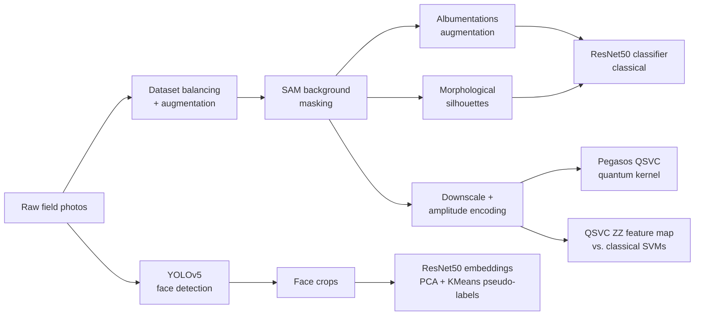

# Fur Seal Face ReIdentification | Classical & Quantum Machine Learning

Individual identification of marine fur seals from field photographs, developed
as a capstone project at **Deakin University** in collaboration with the
**Tulip Lab**.

## The problem

Re-identifying individual fur seals is a genuinely hard recognition task —
considerably harder than most animal re-ID settings:

- **No distinct features.** Unlike zebras (stripes), whale flukes (notch
  patterns), or cheetahs (spot patterns), fur seals carry no unique visible
  markings. Individuals share an almost identical face structure, uniform
  coat colour, and very similar body shape, so there is no obvious feature
  for a model — or even a trained human observer — to latch onto.
- **Field conditions.** Photos are taken in the wild: cluttered rocky/beach
  backgrounds, variable lighting, wet vs. dry fur, and arbitrary poses.
- **Tiny dataset.** Only a handful of photographs exist per individual, so
  the pipeline has to squeeze signal out of very few labelled examples.

Reliable individual identification matters for non-invasive population
monitoring: it replaces physical tagging, which is stressful for the animals
and expensive for researchers.

## Approach


The project combines a classical deep-learning pipeline with quantum machine
learning experiments, and compares them on the same data:



1. **Detection** — a YOLOv5s model fine-tuned to find seal faces in full
   photographs; detections are cropped for downstream stages.
2. **Segmentation** — Meta's Segment Anything Model (SAM, ViT-H) removes the
   background with a centre-point prompt, forcing models to learn from the
   animal rather than the location. Morphological opening/closing additionally
   produces binary silhouettes to probe shape-only identity signal.
3. **Classical recognition** — an ImageNet-pretrained ResNet50 fine-tuned on
   the masked, augmented images; evaluated with per-class precision/recall,
   confusion matrices, and multiclass ROC/AUC.
4. **Semi-supervised track** — ResNet50 embeddings clustered (PCA + KMeans,
   visualised with t-SNE) to generate pseudo-labels for unlabelled crops.
5. **Quantum machine learning** — two quantum kernel methods built with
   Qiskit:
   - **Pegasos QSVC** with amplitude encoding: 128 grayscale pixel values
     encoded into the amplitudes of a 7-qubit state, fidelity quantum kernel,
     Pegasos solver.
   - **QSVC with a ZZ feature map** (Havlicek et al., *Nature* 2019):
     PCA-reduced features angle-encoded on one qubit per dimension, compared
     head-to-head against linear and RBF classical SVMs.

## Repository structure

```
├── src/furseal/            # Python package (ported from the notebooks)
│   ├── data/               # balancing, cropping, resizing, augmentation
│   ├── detection/          # YOLOv5 train/inference wrappers
│   ├── segmentation/       # SAM masking, morphological masks
│   ├── features/           # ResNet50 embeddings, clustering/pseudo-labels
│   ├── classical/          # ResNet50 classifier: train + evaluate
│   └── quantum/            # amplitude encoding, Pegasos QSVC, QSVC
├── notebooks/              # original research notebooks (see notebooks/README.md)
├── configs/                # default hyperparameters, YOLO dataset template
├── docs/PIPELINE.md        # stage-by-stage commands and details
├── tests/                  # unit tests for preprocessing & encoding
└── data/                   # datasets/models live here (git-ignored)
```

## Installation

Python 3.10+ recommended.

```bash
# Clone, then from the repo root:
pip install -e .                    # core (classical) pipeline
pip install -e ".[quantum]"         # + Qiskit quantum ML stack
pip install -e ".[sam]"             # + Segment Anything
pip install -e ".[quantum,sam,dev]" # everything, incl. pytest
```

Extra assets downloaded on demand:

- SAM checkpoint: `wget https://dl.fbaipublicfiles.com/segment_anything/sam_vit_h_4b8939.pth`
- YOLOv5 repo: cloned automatically by `furseal.detection.yolo` on first use.

## Quick start

Each stage is a module with `--help`; the full walkthrough is in
[docs/PIPELINE.md](docs/PIPELINE.md).

```bash
# 1. Balance raw photos into per-individual folders (A..H)
python -m furseal.data.balance --src data/task_datasets --dst data/balanced_task_dataset

# 2. Remove backgrounds with SAM
python -m furseal.segmentation.sam_mask --input data/balanced_task_dataset \
    --output data/masked_dataset --checkpoint sam_vit_h_4b8939.pth

# 3. Augment and train the classical classifier
python -m furseal.data.augment --src data/masked_dataset --dst data/augmented_dataset
python -m furseal.classical.train --data data/augmented_dataset \
    --output data/models/resnet50_furseal.pth
python -m furseal.classical.evaluate --model data/models/resnet50_furseal.pth \
    --data data/balanced_task_dataset

# 4. Quantum experiments (on a 128×128 grayscale copy)
python -m furseal.data.resize --src data/masked_dataset \
    --dst data/reduced_masked_dataset_128x128 --size 128
python -m furseal.quantum.pegasos --data data/reduced_masked_dataset_128x128
python -m furseal.quantum.qsvm    --data data/reduced_masked_dataset_128x128
```

Console-script aliases (`furseal-train`, `furseal-sam-mask`, `furseal-pegasos`,
…) are installed alongside the package — see `pyproject.toml`.


## Notes on the quantum code

The original notebooks were written against Qiskit 0.44/0.45 and the
long-removed Qiskit Aqua API. The package code in `src/furseal/quantum/` is a
port to the current API (`qiskit>=1.0`, `qiskit-machine-learning>=0.8`):
`RawFeatureVector` for amplitude encoding, `FidelityQuantumKernel` for kernel
estimation, and `PegasosQSVC`/`QSVC` for training. Everything runs on local
simulators by default; quantum kernel evaluation scales quadratically with
sample count, so keep datasets small.

## Dataset

The fur seal photographs are part of an ongoing research collaboration and are
**not distributed** with this repository. `data/README.md` documents the
expected layout so the pipeline can be reproduced on your own data.

## Acknowledgements

This capstone project was carried out at **Deakin University** under the
supervision of:

- **Prof. Gang Li** — Director, Tulip Lab, Deakin University
- **Dr. Shiva Raj Pokhrel** — Deakin University

Built on open-source work: [YOLOv5](https://github.com/ultralytics/yolov5)
(Ultralytics), [Segment Anything](https://github.com/facebookresearch/segment-anything)
(Meta AI), [Qiskit / Qiskit Machine Learning](https://qiskit.org) (IBM),
PyTorch & torchvision, scikit-learn, and Albumentations.

References:

1. Havlíček, V. et al. *Supervised learning with quantum-enhanced feature
   spaces.* Nature 567, 209–212 (2019).
2. Rebentrost, P., Mohseni, M. & Lloyd, S. *Quantum support vector machine
   for big data classification.* Phys. Rev. Lett. 113, 130503 (2014).
3. Kirillov, A. et al. *Segment Anything.* ICCV (2023).

## License

[MIT](LICENSE)
